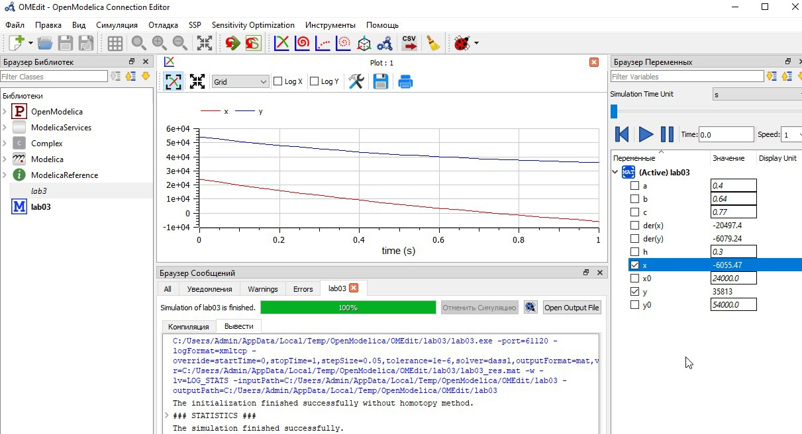
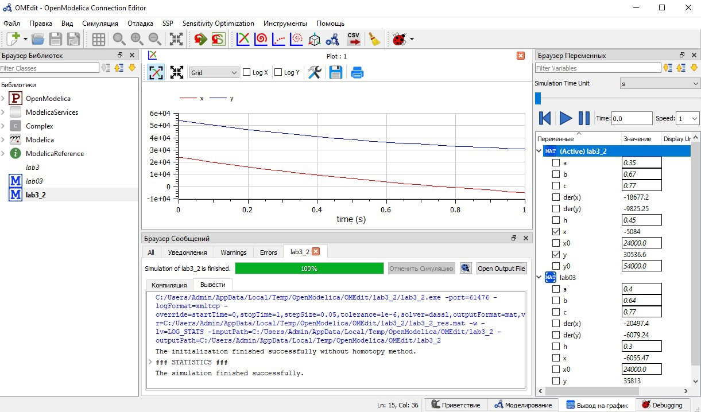

---
## Front matter
lang: ru-RU
title: "Лабораторная работа №3"
author: |
    Рыбалко Элина\inst{1}

institute: |
	\inst{1}RUDN University, Moscow, Russian Federation
  
date: 2022, 24 February, 2022 Murom, Russian Federation  

## Formatting
toc: false
slide_level: 2
theme: metropolis
header-includes: 
 - \metroset{progressbar=frametitle,sectionpage=progressbar,numbering=fraction}
 - '\makeatletter'
 - '\beamer@ignorenonframefalse'
 - '\makeatother'
aspectratio: 43
section-titles: true
---

# Прагматика выполнения лабораторной работы 

 - Изучение основ математического моделирования.

 - Умение строить траектории движения в теории и визуализировать их.

# Цель выполнения лабораторной работы

 Рассмотреть некоторые простейшие модели боевых действий - модели Ланчестера. 

# Задачи выполнения лабораторной работы

- Построить графики изменения численности войск армии $Х$ и армии $У$ для двух случаев:

1. Модель боевых действий между регулярными войсками  
  $\frac{\partial x}{\partial t} = -0,4x(t)-0,64y(t)+sin(t+5) + 1$  
  $\frac{\partial y}{\partial t} = -0,77x(t)-0,3y(t)+cos(t+5) + 1$

2. Модель ведение боевых действий с участием регулярных войск и
партизанских отрядов  
  $\frac{\partial x}{\partial t} = -0,35x(t)-0,67y(t)+sin(2t) + 2$  
  $\frac{\partial y}{\partial t} = -0,77x(t)y(t)-0,45y(t)+cos(t) + 1$

# Результаты выполнения лабораторной работы
 

## Результат выполнения лабораторной работы для первого случая 

{ #fig:001} 

## Результат выполнения лабораторной работы для второго случая

{ #fig:002}  

# Вывод

Рассмотрели некоторые простейшие модели боевых действий - модели Ланчестера. 