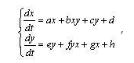

---
# Front matter
lang: ru-RU  
title: "Отчёт по лабораторной работе №3"  
subtitle: "дисциплина: Математическое моделирование"  
author: "Рыбалко Элина Павловна"  

# Generic otions
lang: ru-RU
toc-title: "Содержание"

# Bibliography
bibliography: bib/cite.bib
csl: pandoc/csl/gost-r-7-0-5-2008-numeric.csl

# Pdf output format
toc: true # Table of contents
toc_depth: 2
lof: true # List of figures
lot: true # List of tables
fontsize: 12pt
linestretch: 1.5
papersize: a4
documentclass: scrreprt
## I18n
polyglossia-lang:
  name: russian
  options:
  - spelling=modern
  - babelshorthands=true
polyglossia-otherlangs:
  name: english
### Fonts
mainfont: PT Serif
romanfont: PT Serif
sansfont: PT Sans
monofont: PT Mono
mainfontoptions: Ligatures=TeX
romanfontoptions: Ligatures=TeX
sansfontoptions: Ligatures=TeX,Scale=MatchLowercase
monofontoptions: Scale=MatchLowercase,Scale=0.9
## Biblatex
biblatex: true
biblio-style: "gost-numeric"
biblatexoptions:
  - parentracker=true
  - backend=biber
  - hyperref=auto
  - language=auto
  - autolang=other*
  - citestyle=gost-numeric
## Misc options
indent: true
header-includes:
  - \linepenalty=10 # the penalty added to the badness of each line within a paragraph (no associated penalty node) Increasing the value makes tex try to have fewer lines in the paragraph.
  - \interlinepenalty=0 # value of the penalty (node) added after each line of a paragraph.
  - \hyphenpenalty=50 # the penalty for line breaking at an automatically inserted hyphen
  - \exhyphenpenalty=50 # the penalty for line breaking at an explicit hyphen
  - \binoppenalty=700 # the penalty for breaking a line at a binary operator
  - \relpenalty=500 # the penalty for breaking a line at a relation
  - \clubpenalty=150 # extra penalty for breaking after first line of a paragraph
  - \widowpenalty=150 # extra penalty for breaking before last line of a paragraph
  - \displaywidowpenalty=50 # extra penalty for breaking before last line before a display math
  - \brokenpenalty=100 # extra penalty for page breaking after a hyphenated line
  - \predisplaypenalty=10000 # penalty for breaking before a display
  - \postdisplaypenalty=0 # penalty for breaking after a display
  - \floatingpenalty = 20000 # penalty for splitting an insertion (can only be split footnote in standard LaTeX)
  - \raggedbottom # or \flushbottom
  - \usepackage{float} # keep figures where there are in the text
  - \floatplacement{figure}{H} # keep figures where there are in the text
---

# Цель работы

Рассмотреть некоторые простейшие модели боевых действий - модели Ланчестера.  

## Объект исследования

Моедль боевых действий.

## Предмет исследования

Графики изменения численности войск армии Х и армии У.

# Теоретическое введение

В 1916 году английский математик Фредерик Уильям Ланчестер (1868–1945) предложил систему из двух однородных дифференциальных уравнений для моделирования воздушного боя. Справедливости ради следует отметить, что за год до него подобную модель опубликовал русский математик М. П. Осипов (1915а; 1915б). Но, как обычно происходит в подобных случаях, в литературе для серии подобных моделей утвердился термин «ланчестерские».

Область их применения за почти сто лет также заметно расширилась: от описания взаимодействия этносов, проживающих на одной территории, до модели конкурентного взаимодействия двух фирм.

В наиболее общем виде ланчестерские модели можно описать уравнением (см. рис. -@fig:001):

{ #fig:001} 

где a и e определяют скорость небоевых потерь; b и f – скорость потерь из-за воздействия по площадным целям; c и g – потери от воздействия противника на переднем крае; d и h – подходящие или отходящие резервы. 

Модель собственно Ланчестера (имеются только коэффициенты b и f). В этом случае количество жертв пропорционально количеству встреч между индивидуумами противоборствующих сторон (произведение численности сторон: x × y). Наиболее актуально подобное взаимодействие тогда, когда две стороны располагаются на общей территории (партизанская война, репрессии, вражда двух этносов и т. д.).[[1]](#список-литературы) 

Рассмотрим некоторые простейшие модели боевых действий – модели Ланчестера. В противоборстве могут принимать участие как регулярные войска, так и партизанские отряды. В общем случае главной характеристикой соперников являются численности сторон. Если в какой-то момент времени одна из
численностей обращается в нуль, то данная сторона считается проигравшей (при условии, что численность другой стороны в данный момент положительна).
Рассмотри три случая ведения боевых действий:
1. Боевые действия между регулярными войсками
2. Боевые действия с участием регулярных войск и партизанских
отрядов
3. Боевые действия между партизанскими отрядами
В первом случае численность регулярных войск определяется тремя
факторами:
- скорость уменьшения численности войск из-за причин, не связанных с боевыми действиями (болезни, травмы, дезертирство);
- скорость потерь, обусловленных боевыми действиями
противоборствующих сторон (что связанно с качеством стратегии, уровнем вооружения, профессионализмом солдат и т.п.);
- скорость поступления подкрепления (задаётся некоторой функцией от времени). 

В этом случае модель боевых действий между регулярными войсками описывается следующим образом

Модель боевых действий между регулярными войсками  
  $\frac{\partial x}{\partial t} = -a(t)x(t)-b(t)y(t)+P(t)$  
  $\frac{\partial y}{\partial t} = -c(t)x(t)-h(t)y(t)+Q(t)$  [[2]](#список-литературы).

# Задание

[Вариант 22]

Между страной $Х$ и страной $У$ идет война. Численность состава войск исчисляется от начала войны, и являются временными функциями $x(t)$ и $y(t)$. В начальный момент времени страна $Х$ имеет армию численностью 24 000 человек, а в распоряжении страны $У$ армия численностью в 54 000 человек. Для упрощения модели считаем, что коэффициенты $a, b, c, h$ постоянны. Также считаем $P(t)$ и $Q(t)$ непрерывные функции.

# Выполнение лабораторной работы

## 1. Постановка задачи

Построить графики изменения численности войск армии $Х$ и армии $У$ для следующих случаев:

1. Модель боевых действий между регулярными войсками  
  $\frac{\partial x}{\partial t} = -0,4x(t)-0,64y(t)+sin(t+5) + 1$  
  $\frac{\partial y}{\partial t} = -0,77x(t)-0,3y(t)+cos(t+5) + 1$

2. Модель ведение боевых действий с участием регулярных войск и
партизанских отрядов  
  $\frac{\partial x}{\partial t} = -0,35x(t)-0,67y(t)+sin(2t) + 2$  
  $\frac{\partial y}{\partial t} = -0,77x(t)y(t)-0,45y(t)+cos(t) + 1$

## 2. Построение графиков 

### 2.1. Листинги программ в OpenModelica

1. Модель боевых действий между регулярными войсками  
  $\frac{\partial x}{\partial t} = -0,4x(t)-0,64y(t)+sin(t+5) + 1$  
  $\frac{\partial y}{\partial t} = -0,77x(t)-0,3y(t)+cos(t+5) + 1$

Программа для первого случая.

```
model lab03_1
  parameter Real a = 0.4;
  parameter Real h = 0.3;
  parameter Real b = 0.64;
  parameter Real c = 0.77;
  
  parameter Real x0 = 24000;
  parameter Real y0 = 54000;
  
  Real x(start=x0);
  Real y(start=y0);
  
equation
  der(x) = - a*x - b*y + sin(time + 5) + 1;
  der(y) = - c*x - h*y + cos(time + 5) + 1;

end lab03_1;
 
```
2. Модель ведение боевых действий с участием регулярных войск и партизанских отрядов  
  $\frac{\partial x}{\partial t} = -0,35x(t)-0,67y(t)+sin(2t) + 2$  
  $\frac{\partial y}{\partial t} = -0,77x(t)y(t)-0,45y(t)+cos(t) + 1$

Программа для второго случая.

```
model lab03_2
  parameter Real a = 0.4;
  parameter Real h = 0.3;
  parameter Real b = 0.64;
  parameter Real c = 0.77;
  
  parameter Real x0 = 24000;
  parameter Real y0 = 54000;
  
  Real x(start=x0);
  Real y(start=y0);
  
equation
  der(x) = -a*x - b*y + sin(2*time) + 2;
  der(y) = -c*x - h*y + cos(time) + 1;

end lab03_2;
 
```

### 2.2. Полученные графики  
После запуска кода программы получили следующие графики для первого и второго случая соответственно  (см. рис. -@fig:002 и -@fig:003).

{ #fig:002} 

{ #fig:003} 

### 2.3. Анализ результатов:

Как можно заметить из рис. -@fig:002 и -@fig:003, в обоих случаях победу одерживают войска $Y$: примерно к моменту времени $t≈0.7$ численность армии $X$ приравневается к нулю. Разница лишь в том, что во втором случае в конечном итоге численность победивших войск чуть меньше, чем в первом. В основном такой исход можно объяснить начальными условиями: у армии $У$ численность войск выше численности войск армии $X$ чуть больше чем в два раза, что значительно влияет на исход событий.

# Вывод

Рассмотрели некоторые простейшие модели боевых действий - модели Ланчестера. 

# Список литературы {.unnumbered}

1. [Модель боевых действий](https://docviewer.yandex.ru/view/289699604/?page=7&*=brt3%2BdIUhhVQ1Hw%2BOHP5oFz6YeJ7InVybCI6Imh0dHBzOi8vc3R1ZC1zY2kucnVkbi5ydS9wbHVnaW5maWxlLnBocC8xNjg3Ni9tb2RfZm9sZGVyL2NvbnRlbnQvMC9wcm9qZWN0MDIucGRmP2ZvcmNlZG93bmxvYWQ9MSIsInRpdGxlIjoicHJvamVjdDAyLnBkZj9mb3JjZWRvd25sb2FkPTEiLCJub2lmcmFtZSI6dHJ1ZSwidWlkIjoiMjg5Njk5NjA0IiwidHMiOjE2NDU2MzU0NzY1MDYsInl1IjoiNDM5NDc5NDA1MTU5NjE3ODEwNCIsInNlcnBQYXJhbXMiOiJ0bT0xNjQ1NjM1NDYzJnRsZD1ydSZsYW5nPXJ1Jm5hbWU9cHJvamVjdDAyLnBkZj9mb3JjZWRvd25sb2FkPTEmdGV4dD0lRDAlQTAlRDAlQjAlRDElODElRDElODElRDAlQkMlRDAlQkUlRDElODIlRDElODAlRDAlQjglRDAlQkMrJUQwJUJEJUQwJUI1JUQwJUJBJUQwJUJFJUQxJTgyJUQwJUJFJUQxJTgwJUQxJThCJUQwJUI1KyVEMCVCRiVEMSU4MCVEMCVCRSVEMSU4MSVEMSU4MiVEMCVCNSVEMCVCOSVEMSU4OCVEMCVCOCVEMCVCNSslRDAlQkMlRDAlQkUlRDAlQjQlRDAlQjUlRDAlQkIlRDAlQjgrJUQwJUIxJUQwJUJFJUQwJUI1JUQwJUIyJUQxJThCJUQxJTg1KyVEMCVCNCVEMCVCNSVEMCVCOSVEMSU4MSVEMSU4MiVEMCVCMiVEMCVCOCVEMCVCOSslRTIlODAlOTMrJUQwJUJDJUQwJUJFJUQwJUI0JUQwJUI1JUQwJUJCJUQwJUI4KyVEMCU5QiVEMCVCMCVEMCVCRCVEMSU4NyVEMCVCNSVEMSU4MSVEMSU4MiVEMCVCNSVEMSU4MCVEMCVCMC4rJUQwJTkyKyVEMCVCRiVEMSU4MCVEMCVCRSVEMSU4MiVEMCVCOCVEMCVCMiVEMCVCRSVEMCVCMSVEMCVCRSVEMSU4MCVEMSU4MSVEMSU4MiVEMCVCMiVEMCVCNSslRDAlQkMlRDAlQkUlRDAlQjMlRDElODMlRDElODIrJUQwJUJGJUQxJTgwJUQwJUI4JUQwJUJEJUQwJUI4JUQwJUJDJUQwJUIwJUQxJTgyJUQxJThDKyVEMSU4MyVEMSU4NyVEMCVCMCVEMSU4MSVEMSU4MiVEMCVCOCVEMCVCNSslRDAlQkElRDAlQjAlRDAlQkErJUQxJTgwJUQwJUI1JUQwJUIzJUQxJTgzJUQwJUJCJUQxJThGJUQxJTgwJUQwJUJEJUQxJThCJUQwJUI1KyVEMCVCMiVEMCVCRSVEMCVCOSVEMSU4MSVEMCVCQSVEMCVCMCUyQyslRDElODIlRDAlQjAlRDAlQkErJUQwJUI4KyVEMCVCRiVEMCVCMCVEMSU4MCVEMSU4MiVEMCVCOCVEMCVCNyVEMCVCMCVEMCVCRCVEMSU4MSVEMCVCQSVEMCVCOCVEMCVCNSslRDAlQkUlRDElODIlRDElODAlRDElOEYlRDAlQjQlRDElOEIuKyVEMCU5MislRDAlQkUlRDAlQjElRDElODklRDAlQjUlRDAlQkMrJUQxJTgxJUQwJUJCJUQxJTgzJUQxJTg3JUQwJUIwJUQwJUI1KyVEMCVCMyVEMCVCQiVEMCVCMCVEMCVCMiVEMCVCRCVEMCVCRSVEMCVCOSslRDElODUlRDAlQjAlRDElODAlRDAlQjAlRDAlQkElRDElODIlRDAlQjUlRDElODAlRDAlQjglRDElODElRDElODIlRDAlQjglRDAlQkElRDAlQkUlRDAlQjkrJUQxJTgxJUQwJUJFJUQwJUJGJUQwJUI1JUQxJTgwJUQwJUJEJUQwJUI4JUQwJUJBJUQwJUJFJUQwJUIyKyVEMSU4RiVEMCVCMiVEMCVCQiVEMSU4RiVEMSU4RSVEMSU4MiVEMSU4MSVEMSU4RislRDElODclRDAlQjglRDElODElRDAlQkIlRDAlQjUlRDAlQkQlRDAlQkQlRDAlQkUlRDElODElRDElODIlRDAlQjgrJUQxJTgxJUQxJTgyJUQwJUJFJUQxJTgwJUQwJUJFJUQwJUJELislRDAlOTUlRDElODElRDAlQkIlRDAlQjgrJUQwJUIyKyVEMCVCQSVEMCVCMCVEMCVCQSVEMCVCRSVEMCVCOS0lRDElODIlRDAlQkUrJUQwJUJDJUQwJUJFJUQwJUJDJUQwJUI1JUQwJUJEJUQxJTgyKyVEMCVCMiVEMSU4MCVEMCVCNSVEMCVCQyVEMCVCNSVEMCVCRCVEMCVCOCslRDAlQkUlRDAlQjQlRDAlQkQlRDAlQjArJUQwJUI4JUQwJUI3KyVEMSU4NyVEMCVCOCVEMSU4MSVEMCVCQiVEMCVCNSVEMCVCRCVEMCVCRCVEMCVCRSVEMSU4MSVEMSU4MiVEMCVCNSVEMCVCOSslRDAlQkUlRDAlQjElRDElODAlRDAlQjAlRDElODklRDAlQjAlRDAlQjUlRDElODIlRDElODElRDElOEYrJUQwJUIyKyVEMCVCRCVEMSU4MyVEMCVCQiVEMSU4QyUyQyslRDElODIlRDAlQkUrJUQwJUI0JUQwJUIwJUQwJUJEJUQwJUJEJUQwJUIwJUQxJThGKyVEMSU4MSVEMSU4MiVEMCVCRSVEMSU4MCVEMCVCRSVEMCVCRCVEMCVCMCslRDElODElRDElODclRDAlQjglRDElODIlRDAlQjAlRDAlQjUlRDElODIlRDElODElRDElOEYrJUQwJUJGJUQxJTgwJUQwJUJFJUQwJUI4JUQwJUIzJUQxJTgwJUQwJUIwJUQwJUIyJUQxJTg4JUQwJUI1JUQwJUI5KyUyOCVEMCVCRiVEMSU4MCVEMCVCOCslRDElODMlRDElODElRDAlQkIlRDAlQkUlRDAlQjIlRDAlQjglRDAlQjglMkMrJUQxJTg3JUQxJTgyJUQwJUJFKyVEMSU4NyVEMCVCOCVEMSU4MSVEMCVCQiVEMCVCNSVEMCVCRCVEMCVCRCVEMCVCRSVEMSU4MSVEMSU4MiVEMSU4QyslRDAlQjQlRDElODAlRDElODMlRDAlQjMlRDAlQkUlRDAlQjkrJUQxJTgxJUQxJTgyJUQwJUJFJUQxJTgwJUQwJUJFJUQwJUJEJnVybD1odHRwcyUzQS8vc3R1ZC1zY2kucnVkbi5ydS9wbHVnaW5maWxlLnBocC8xNjg3Ni9tb2RfZm9sZGVyL2NvbnRlbnQvMC9wcm9qZWN0MDIucGRmJTNGZm9yY2Vkb3dubG9hZCUzRDEmbHI9MTA2NjgmbWltZT1wZGYmbDEwbj1ydSZzaWduPTBmN2QzOTcyMDYzYjVhNWVmYjFmNDJlYTZiMzc5YzQ3JmtleW5vPTAifQ%3D%3D&lang=ru)
2. [Определение жертв войн через ланчестерские модели](https://www.socionauki.ru/journal/articles/130365/)
3. [Руководство по формуле Cmd Markdown](https://russianblogs.com/article/26051452570/)
4. [Математическое моделирование при решении задач](https://urok.1sept.ru/articles/609795)
5. [С.В. Каштаева, Математическое моделирование / Учебное пособие](http://pgsha.ru:8008/books/study/%CA%E0%F8%F2%E0%E5%E2%E0%20%D1.%20%C2.%20%CC%E0%F2%E5%EC%E0%F2%E8%F7%E5%F1%EA%EE%E5%20%EC%EE%E4%E5%EB%E8%F0%EE%E2%E0%ED%E8%E5..pdf)
6. [Руководство по оформлению Markdown файлов](https://gist.github.com/Jekins/2bf2d0638163f1294637)